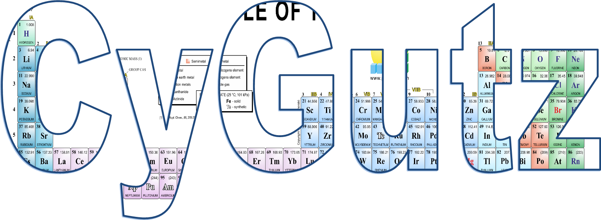

Introduction
============

CyGutz is an efficient Gutzwiller solver,
which solves a generic tight-binding model with local interactions
using Gutzwiller-rotationally invariant slave-boson method.
(See Ref. [prx2015]_ and [prl2017]_)

.. [prx2015] Lanatà, Nicola, Yongxin Yao, Cai-Zhuang Wang, Kai-Ming Ho,
   and Gabriel Kotliar. 2015.
   ''Phase Diagram and Electronic Structure of Praseodymium and Plutonium.''
   Physical Review X 5 (1): 011008.
   doi:10.1103/PhysRevX.5.011008.
.. [prl2017] Lanatà, Nicola, Yongxin Yao, Xiaoyu Deng, Vladimir Dobrosavljević,
   and Gabriel Kotliar. 2017.
   ''Slave Boson Theory of Orbital Differentiation with Crystal Field Effects:
   Application to UO :sub:`2`.''
   Physical Review Letters 118 (12): 126401.
   doi:10.1103/PhysRevLett.118.126401.
