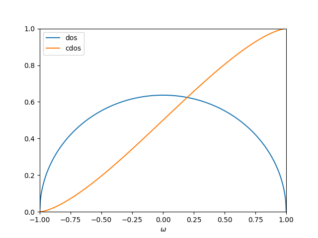
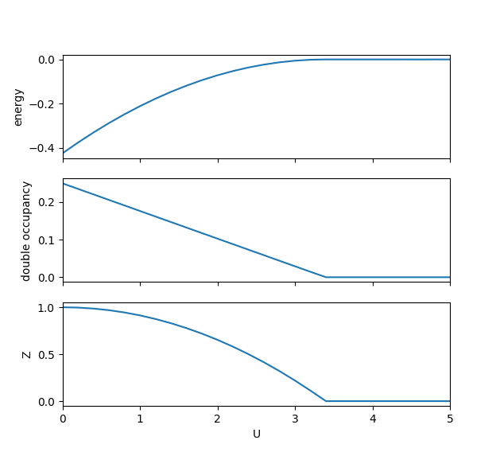
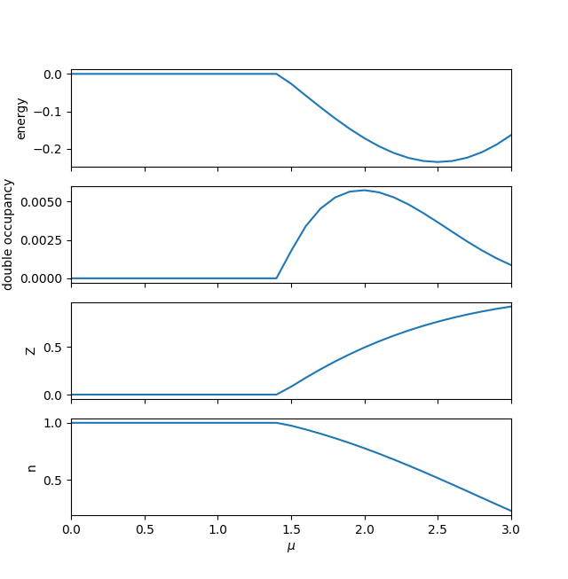

Single-band Bethe lattice
-------------------------

In this example, we study a special one-band Hubbard model, 
which has semi-circular noninteracting density of states (dos),
It corresponds to Bethe lattice with infinite coordination number.
You will learn:

* How to set up a simple model calculation
* How the correlation strength induces metal-insulator transition 
  in the Gutzwiller-slave-boson theory
* How to determine the energy gap for the Mott-insulating phase

There is predefined class,
which helps generating the energy mesh with uniform weight.

.. autoclass:: pyglib.model.special.semicircular
    :members: 

In the model, we use half-band width as the energy unit. 
The noninteracting dos and cumulative dos is shown as below:

A function to setup the model for *CyGutz* calculation 
has been defined,

.. autofunction:: pyglib.model.semicir.gutz_model_setup
    
For convenience, we have also predefined a function 
to run *CyGutz* for a list of Hubbard U or chemical potential :math:`\mu`,

.. autofunction:: scan_semicirc.generate_data

Let us first look at the case of :math:`\mu` =0, 
i.e., in the particle-hole symmetric case. 
Let us perform a series of *CyGutz* calculations with increasing U, 
and check the behavior of the total energy, the double occupancy, 
and the quasi-particle weight (Z).
Recall that in Gutzwiller-slave boson theory,
Z=0 implies the system is in the Mott insulating phase,
where all the spectral weight becomes non-coherent. 

A script for a job of scanning U is defined as

.. autofunction:: scan_semicirc.scan_u

For a hands-on practice, change to a testing directory, 
copy the source file or download :download:`scan_semicirc.py 
<../../pyglib/pyglib/model/test/scan_semicirc.py>`.
Type the following command::

    $ python ./scan_semicirc.py

It will automatically generate the following results:

One can see that the :math:`U_{c}` ~ 3.4 for the metal-insulator transition.

Although the theory gives a very simplified picture of the Mott insulator,
i.e., double occupancy or quasi-particle weight is 0, 
it is possible to get the band gap size by varying the chemical potential.

A script for a job of scanning :math:`\mu` at U=5 is defined as

.. autofunction:: scan_semicirc.scan_mu

Type the following command::

    $ python ./scan_semicirc.py -mu

It will automatically generate the following results:

One can see that the physical quantities of interest stay constant
in the gap region. 
When :math:`\mu` increases over ~ 1.4, 
the orbital occupation :math:`n` starts to decrease,
indicating the gap size ~ 1.4*2 = 2.8. 
The factor of 2 comes from  particle-hole symmetry.
