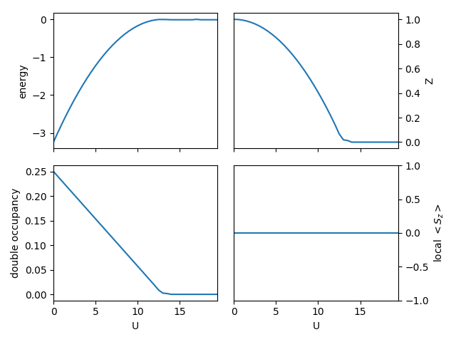
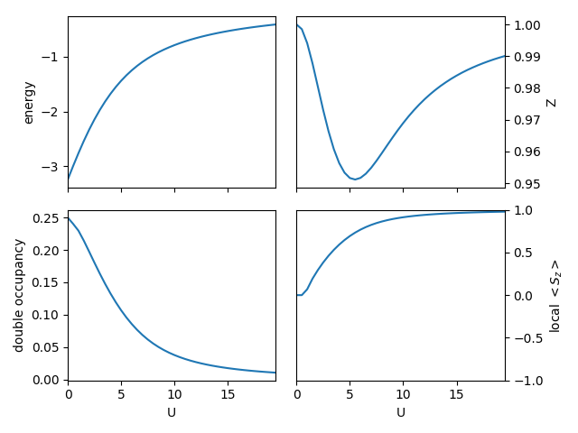
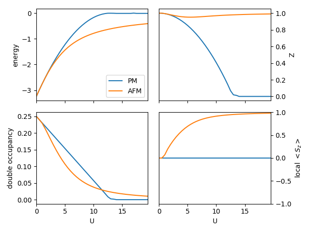
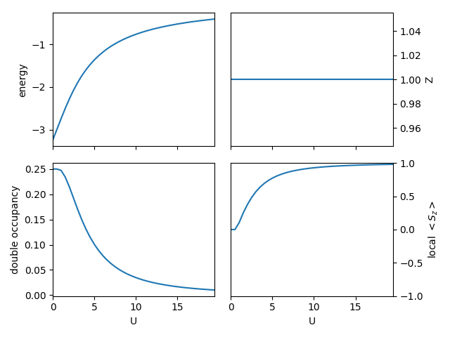
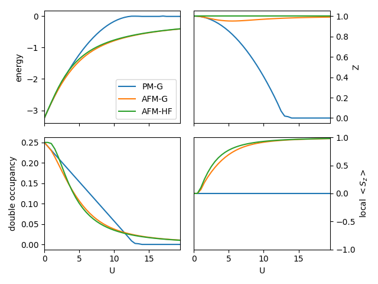
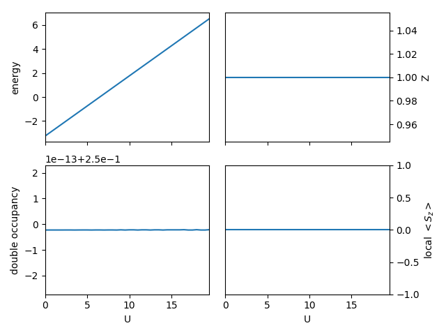
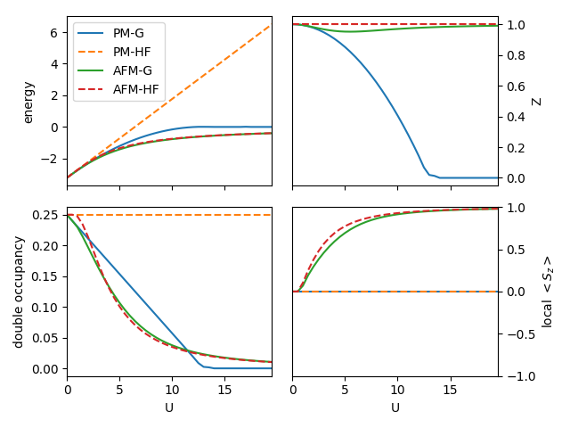

Checkboard lattice
------------------

In this example, we study 2-dimensional checkerboard lattice
with nearest neighbor hopping.
You will learn:

* How to set up a finite dimension (here 2D) lattice with multiple sites 
  per unit cell.
* How to setup simple antiferromagnetic (AFM) calculations.
* How the Gutzwiller method improves the descriptions
  at Hartree-Fock mean field level.

In the model, we use nearest neighbor hopping :math:`t` as the energy unit. 
A function to setup the model for *CyGutz* calculation 
has been defined,

.. autofunction:: pyglib.model.checkboard.gutz_model_setup
    
For convenience, we have also predefined a function 
to run *CyGutz* for a list of Hubbard U in paramagnetic (PM) or AFM phase.

.. autofunction:: scan_checkboard.generate_data

Let us perform a series of *CyGutz* calculations with increasing U 
in the PM phase, 
and check the behavior of the total energy, the double occupancy, 
and the quasi-particle weight (Z),
in a similar way as in the example of Bethe lattice.
Recall that in Gutzwiller-RISB theory,
Z=0 implies the system is in the Mott insulating phase,
where all the spectral weight becomes non-coherent. 

A script for a job of scanning U in PM phase is defined as

.. autofunction:: scan_checkboard.scan_u

For a hands-on practice, change to a testing directory, 
copy the source file or download :download:`scan_checkboard.py 
<../../pyglib/pyglib/model/test/scan_checkboard.py>`.
Type the following command::

    $ python ./scan_checkboard.py

It will automatically generate the following results:

One can see similar generic feature of the local physical quantities
as in the previous Bethe lattice calculations, 
albeit a larger :math:`U_{c}` ~ 13 for the metal-insulator transition.

Now let us perform a similar scan of U for the checkerboard AFM phase,
i.e., there are two sublattices with up and down local spin moment.

Type the same command with an inline argument of '-sp' to trigger 
the setup of AFM phase::

    $ python ./scan_checkboard.py -sp

Here the user is advised to review the follwing function

.. autofunction:: pyglib.model.checkboard.gutz_model_setup

where spindeg changes to ``False`` by the inline argument '-sp',
and 'updn_full_list=[1,-1]' will be used in the ``batch_initialize``.
The following figure will be automatically generated:

One can see that the local spin moment :math:`<S_{z}>` rises from zero 
with increasing :math:`U`, and saturates at 1, 
as a half-filling single-orbital system.
The kinetic energy renormalization factor :math:`Z` 
shows a non-monotonic behavior -- result of a competition 
between the effect of increasing onsite interaction, 
which will reduce :math:`Z`, and that of approaching empty/full filling 
of the single spin-orbital channels,
evidenced by the rising local spin moment, 
as it is defined as :math:`<S_{z}> = <n_up> - <b_dn>`.

It would interesting to compare the results of PM and AFM phase. 
By downloading the script :download:`plot_pmafm.py
<../../pyglib/pyglib/model/test/plot_pmafm.py>` and typing::

    $ python ./plot_pmafm.py

One would get the following figure:

It is clear that the magnetically ordered AFM phase has lower energy 
than the PM phase. As compared with PM solutions, the kinetic energy
renormalization factor :math:`Z` only changes marginally in the AFM phase.
The local double occupancy decreases smoothly in a nonlinear way 
in AFM phase, in contrast to the linear decreasing in PM phase.

One would be interesting to see how the AFM solution 
obtained in the Gutzwiller method 
compare with the results from simple Hartree-Fock (HF) mean-field approach.
The HF-type calculations can be conveniently be performed by typing::

    $ python ./scan_checkboard.py -uhf

where the inline argument '-uhf' changes the flag of `iembeddiag` to 10,
corresponding to solve the embedding Hamiltonian of the Gutzwiller method 
at HF level. 
Upon execution of the above command, 
the following figure will be generated:

One can see similar features as the results based on Gutzwiller calculations,
but here the kinetic energy renormalization factor :math:`Z` is a constant 1.

To plot the three calculations together, one can download
:download:`plot_pmafm_gh.py
<../../pyglib/pyglib/model/test/plot_pmafm_gh.py>` and type::

    $ python ./plot_pmafm_gh.py

The following figure will be produced:

As one can see, the Gutzwiller AFM solutions show much smoother variation 
of the local double occupancy, reduced local spin moment and smaller kinetic
energy renormalization factor :math:`Z`, and lower in total energy,
in comparison with HF results.
It is consistent with the respect of variational principle, 
because the Gutzwiller approach provides more variational degrees of freedom
by local Gutzwiller correlator. 

One might be actually surprised for seeing that the spin-unrestricted HF (UHF)
results are not bad, although HF method is known to not able to 
describe strong electron correlation effects. 
The reason is that here we are looking at the symmetry breaking solutions,
where the ``static correlation`` due to the presence of (almost) 
degenerate ground states has been removed. 
In order yo visualize the ``static correlcation`` error in HF method,
one can check the HF PM solutions. Typing the following commands::

    $ python ./scan_checkboard.py -rhf

The following results will be shown:

One can clearly see the constant double occupancy 
and the consequent linear increasing of the total energy 
in the spin-restricted HF (RHF) calculations.

In comparison with all the other calculations, as shown by downloading
:download:`plot_pmafm_gh2.py
<../../pyglib/pyglib/model/test/plot_pmafm_gh2.py>` and typing::

    $ python ./plot_pmafm_gh2.py

The following produced figure clearly 
shows the static correlation error of RHF, 
as the RHF total energy deviates more and more with increasing :math:`U`.

This concludes the second tutorial.
