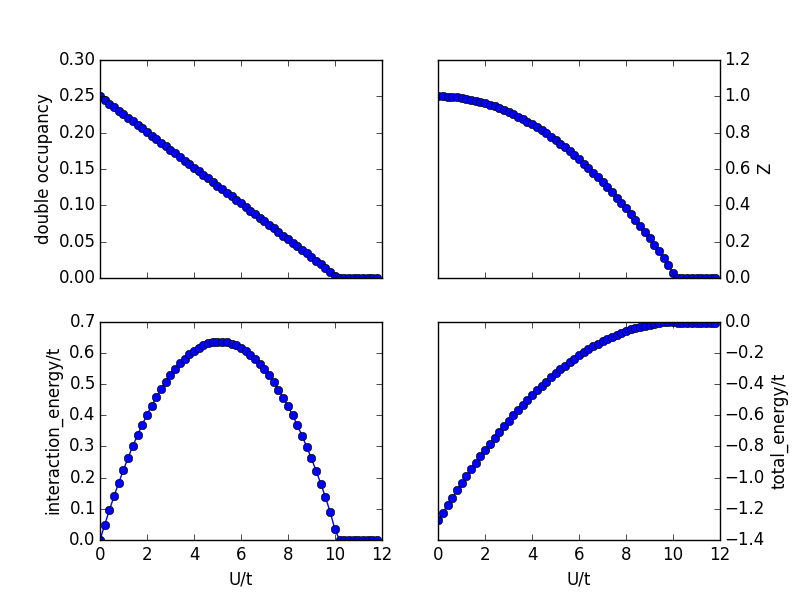
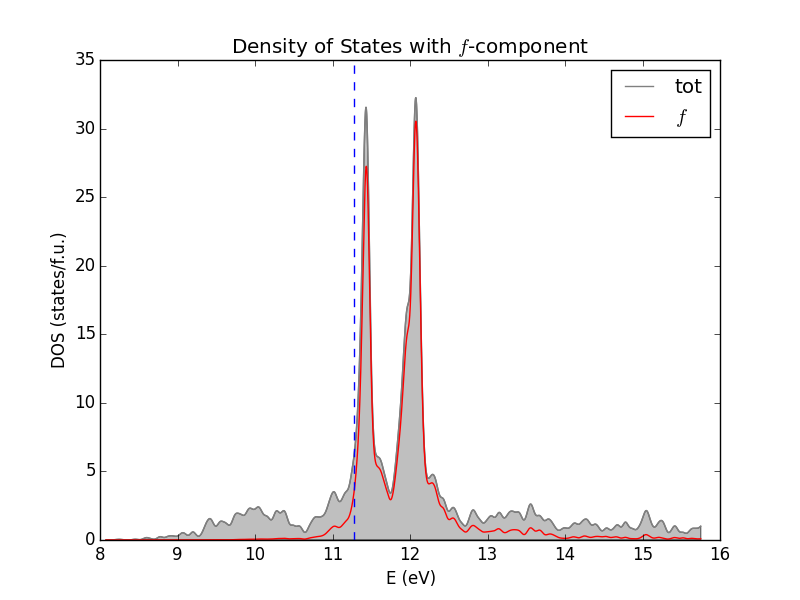
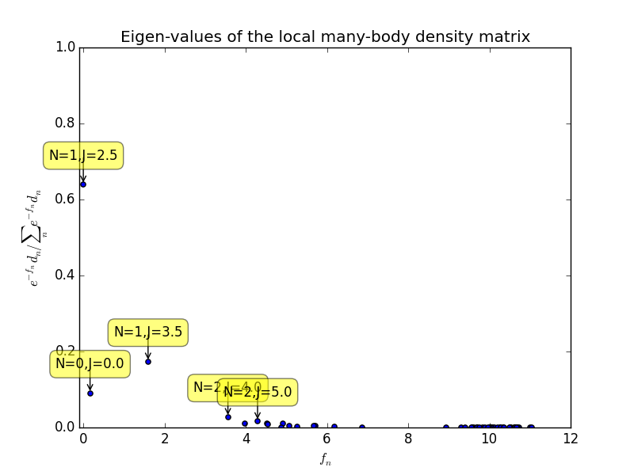
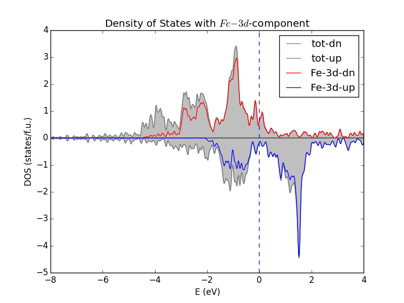
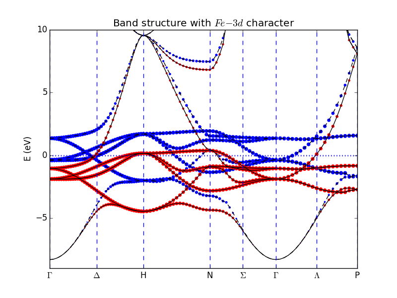
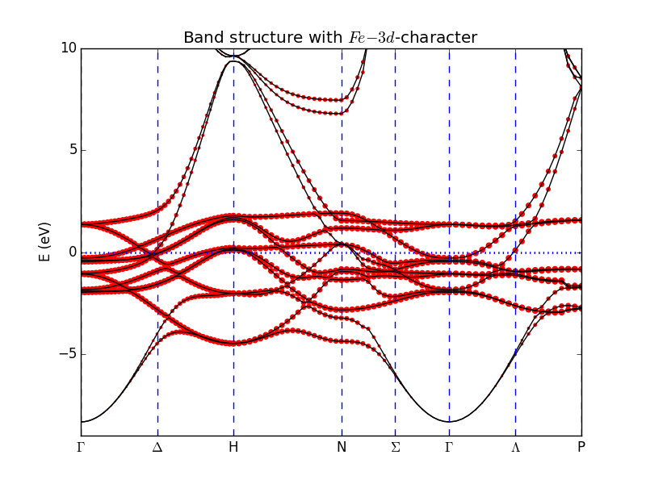

Tutorial
========

Added note: the code was recently used in the ``Theory Winter School`` 
hosted by the National High Magnetic Field Laboratory.
See https://nationalmaglab.org/news-events/events/for-scientists/winter-theory-school. 
The lecture and handson notes can be downloaded here (https://nationalmaglab.org/images/news_events/searchable_docs/winterschool/2017/talk_lanata.pdf).

Single Band Hubbard Model
-------------------------
In this example, you will learn how to setup a simple 1-D Hubbard model with nearest neighbor hopping, and perform Gutzwiller-Slave-Boson calculations.

.. automodule:: 1_1D_1_band_Hubbard_Model
   :members:

.. automodule:: scan_U_1_1D_1_band_Hubbard_Model
   :members:

The results are shown in the following figure, where Mott transition is identified by Z reaching zero near U/t=10.

Bilayer Model
-------------
In this example, you will learn how to setup a simple bilayer Hubbard model and 
perform cluster-Gutzwiller-Slave-Boson calculations.

.. automodule:: 2_1D_bilayer_Model
   :members:

:math:`\alpha`-Ce with spin-orbit interaction
---------------------------------------------
In this example, you will learn how to perform a 
Wien2k + Gutzwiller-Slave-Boson calculation.

1) Finish a self-consistent lapw + so calculation 
   for :math:`\alpha`-Ce using WIEN2k.
   Here is the structure 
   file :download:`Ce.struct <../../examples/3_Ce_soc/Ce.struct>`. 
   To compare with the provided results, one should keep 
   the R\ :sub:`MT` = 2.5 as specified in the Ce.struct,
   R\ :sub:`MT` * K\ :sub:`MAX` = 9.0 and 
   total number of k-points = 5000 (17x17x17). 
   We do not shift k-points here.
   We would recommend to set emax=4.5 (higher value) in case.inso file.
2) type::

     $ ${WIEN_GUTZ_ROOT}/tools/Gutzwiller/init_ga.py 

   Read the list of questions and pick your options::

     User inputs to initialize the ga job.
     Do you want to BREAK SPIN-SYMMETRY? Pick one from [y, n]...n
     Do you want to COMPLETELY BREAK ORBITAL-SYMMETRY? Pick one from [y, n]...n
     atom  0   Ce
     Is this atom correlated? Pick one from [y, n]...y
     Enter correlated shells? Pick one or combinations separated by blank space from [s, p, d, f]...f
     Do you want to take into account the SPIN-ORBIT interaction? Pick one from [y, n]...y
     Do you want to take into account the CRYSTAL FIELD effect? Pick one from [y, n]...n
    
     LHUB = 1: Slater-Condo parametrization.
     LHUB = 0: U_{i,j,k,l} (NO SPIN INDEX) = int_{dr int_{dr' phi^{*}(r_i) phi^{*}(r'_j) phi(r_k) phi(r'_l)}} 
               will be provided by file V2AO.INP
     LHUB =-1: U_{i,j,k,l} (INCLUDING SPIN INDEX) = int_{dr int_{dr' phi^{*}(r_i) phi^{*}(r'_j) phi(r_k) phi(r'_l)}} 
               will be provided by file V2H.INP
     Please select LHUB:  Pick one from [-1, 0, 1]...1
    
     LDC = 12:  Recommended. Standard double counting (updating Vdc at each charge iteration, initial n0 to be provided.) 
     LDC =  2:  Fix double counting potential (keep same Vdc/n0 at each charge iteration, n0 to be provided.) 
     LDC =  1:  Standard double counting potential (n0 self-consistently determined.) 
     LDC =  0:  No double counting. 
     Please select LDC:  Pick one from [0, 1, 2, 12]...12
    
     LCLUSTER = 0: Single-atom impurity.
     LCLUSTER = 1: Multi-atom (cluster) impurity.
     Please select LCLUSTER:  Pick one from [0, 1]...0
    
     Solution embedding system:
     LEIGV = 0:  Choose automatically solver depending on the size of the problem (DEFAULT) 
             1:  Exact diagonalization (ZHEEV) in LAPACK
             2:  Lanczos (zhdrv1) in ARPACK 
             3:  Exact diagonalization (ZHEEVX, selective lowest two eigen-vectors) in LAPACK
             5:  PRIMEE (Iterative MultiMethod Eigensolver)
     Please select LEIGV:  Pick one from [0, 1, 2, 3, 5]...5
     INFORMATION FOR f ELECTRONS OF Ce :
     Please provide interaction parameters U,J separated by a space: 6.0 0.7
     Please provide N1,N2 defining valence range [N1,N2] separated by a space ( 0 < N1 < N2 < 14 ): 0 4
     Please provide guess n0 for valence (0 < n0 < 4): 1.0
     Please run ga_init_dmft.py with parameters given in  init_ga.slog

   Thus it finishes the setup of all the necessary files for CyGutz.
3) To use the wien2k+dmft projectors, we will type::

     $ ${WIEN_GUTZ_ROOT}/ga_init_dmft.py

   Read the list of questions and use the answers provided in ``init_ga.slog``.
4) Now we are ready to run the wien2k+Gutzwiler/Slave-Boson self-cponsistently by typing::

     $ ${WIEN_GUTZ_ROOT}/ga_run_dmft.py

   Like WIEN2k jobs, the total energy is stored in ``case.scf`` file like :download:`Ce.scf <../../examples/3_Ce_soc/Ce.scf>`. 
   The main CyGutz output (last electron density step) is located in :download:`GL_LOG.OUT <../../examples/3_Ce_soc/GL_LOG.OUT>`
   and :download:`glog.h5 <../../examples/3_Ce_soc/glog.h5>`.

DOS plot for :math:`\alpha`-Ce
------------------------------
In this example, you will learn how to plot the density of states of Ce after the self-consistent calculation in the previous example, as shown in the following figure:

1) Use :download:`plot_dos.py <../../examples/5_Ce_dos/plot_dos.py>` to plot the total and partial dos by typing::

   $ python ./plot_dos.py

   Check the script for detailed explanations.

Eigen-values of the local reduced density matrix for :math:`\alpha`-Ce   
----------------------------------------------------------------------
In this example, you will learn how to plot the eigen-values of the local reduced many-body density matrix using the exponential form \rho=exp(-F), as shown in the figure below:

1) Use :download:`multiplets_analysis_soc.py <../../examples/6_Ce_multiplets/multiplets_analysis_soc.py>` to plot by typing::

   $ python ./multiplets_analysis_soc.py

   Check the script for detailed explanations.

Band structure calculation for :math:`\alpha`-Ce
------------------------------------------------
In this example, you will learn how to plot the band structure of Ce, as shown in the following figure:

.. image:: _images/CeBands.png
   :alt: alternate text
   :scale: 100 %
   :align: center

1) (Optional) make a copy of the self-consistent LDA+G calculation in the previous step by typing::
   
     $ ${WIEN_GUTZ_ROOT}/tools/Gutzwiller/save_lapwg -a -d Ce_SCF

2) Modifying the parameters in GL.INP file by typing::

     $ sed -i 's/.*LSCF.*/LSCF = 2/' GL.INP && sed -i 's/.*LSCF.*/&\nLEL0 = 1/' GL.INP && sed -i 's/.*LSCF.*/&\nLEFERMI = 1/' GL.INP

3) Type the following command to fix the one-body part of the local Hamiltonian and Fermi-level at the scf calculation values::

     $ cp WH_EL0.OUT WH_EL0.INP && cp EFLDA.OUT EFLDA.INP

4) Prepare the `Ce.klist_band` file for the high-symmetry k-path of the primitive Brillouin Zone (Check Wien2k user guide for details.)
   In this example, the `fcc.klist_band` file in the `SRC_templates` directory of WIEN2k is used.
5) Here we do a bit differently from WIEN2k by replacing `Ce.klist` with `Ce.klist_band`::

     $ mv *.klist_band *.klist

6) Now Calculate the bands along the specified k-path::

     $ ${WIEN_GUTZ_ROOT}/ga_run_dmft.py -s lapw1 -e CyGutz

7) Download :download:`plot_bands.py <../../examples/4_Ce_bands/plot_bands.py>` to plot the band structure by typing::

   $ python ./plot_bands.py

Ferromagnetic calculation for :math:`\alpha`-Fe
-----------------------------------------------
In this example you will learn how to set up a ferromagnetic calculation 
within LDA + Gutzwiller Slave-Boson method.

1) Finish a self-consistent LDA paramagnetic calculation (run_lapw) 
   for BCC-Ce using WIEN2k.
   Here is the structure file
   :download:`Fe.struct <../../examples/7_Fe_FM/Fe.struct>`. 
   To compare with the provided results, 
   one should keep the R\ :sub:`MT` = 2.33 as specified in the Fe.struct,
   R\ :sub:`MT` * K\ :sub:`MAX` = 8.0 and 
   total number of k-points = 5000 (17x17x17). 
   We do not shift k-points here.
2) type::

     $ ${WIEN_GUTZ_ROOT}/tools/Gutzwiller/init_ga.py 

   Read the list of questions and pick your options::

     User inputs to initialize the ga job.
    
     Do you want to BREAK SPIN-SYMMETRY?
     Pick one from [y, n]...y
    
     Do you want to COMPLETELY BREAK ORBITAL-SYMMETRY?
     Pick one from [y, n]...y
    
     Symmetrically-equivalent atom indices:  0
     (note: '0 0 0 1 1' means 1-3 and 4-5 are two inequivalent atoms).
     Accept?
     Pick one from [y, n]...y
    
     ------------
     atom  0   Fe
    
     Is this atom correlated?
     Pick one from [y, n]...y
    
     Enter correlated shells?
     Pick one or combinations separated by blank space
     from [s, p, d, f]...d
    
     Do you want to take into account the SPIN-ORBIT interaction?
     Pick one from [y, n]...n
    
     LHUB = 1: Slater-Condo parametrization.
            2: Kanamori parametrization (useful for models).
            0: U_{i,j,k,l} (NO SPIN INDEX) =
               int_{dr int_{dr' phi^{*}(r_i) phi^{*}(r'_j)
               V(|r-r'|) phi(r_k) phi(r'_l)}}
               will be provided by file V2AO.INP
           -1: U_{i,j,k,l} (INCLUDING SPIN INDEX) =
               int_{dr int_{dr' phi^{*}(r_i) phi^{*}(r'_j)
               phi(r_k) phi(r'_l)}}
               will be provided by file V2H.INP
     Please select LHUB:
     Pick one from [1, -1, 0, 2]...1
    
     LDC = 12: Recommended. Standard double counting
               (updating Vdc at each charge iteration,
               initial n0 to be provided.)
            2: Fix double counting potential
               (keep same Vdc/n0 at each charge iteration,
               n0 to be provided.)
            1: Standard double counting potential
               (n0 self-consistently determined.)
            0:  No double counting.
     Please select LDC:
     Pick one from [12, 0, 1, 2]...12
    
     Please enter the tolerance of solving the equations of {R, \lambda}
     (recommend 1.e-5 or smaller)...1.e-6
    
     LCLUSTER = 0: Single-atom impurity.
                1: Multi-atom (cluster) impurity.
     Please select LCLUSTER:
     Pick one from [0, 1]...0
    
     Solution embedding system:
     LEIGV = 0: Choose automatically solver depending
                on the size of the problem (DEFAULT)
             1: Exact diagonalization (ZHEEV) in LAPACK
             2: Lanczos (zhdrv1) in ARPACK
             3: Exact diagonalization (ZHEEVX,
                selective lowest two eigen-vectors) in LAPACK
             5: PRIMEE (Iterative MultiMethod Eigensolver)
     Please select LEIGV:
     Pick one from [5, 0, 1, 2, 3]...5
    
     INFORMATION FOR d ELECTRONS OF Fe :
     Please provide interaction parameters U,J
     separated by a space: 7.0 0.8
     Please provide N1,N2 defining valence range [N1,N2]
     separated by a space ( 0 < N1 < N2 < 10 ): 0 10
     Please provide guess n0 for valence
     (0 < n0 < 10 overwritten by GL_NELF1.INP): 6.5
     Please run ga_init_dmft.py with parameters given in init_ga.slog

   In order to break spin-symmetry, we add a uniform magnetic field to
   the initial guess of the solution. Note that we are NOT applying a 
   magnetic field to the system physically. We type::

     $ ${WIEN_GUTZ_ROOT}/tools/Gutzwiller/apply_initial_B_field.py

   and answer the questions accordingly::

     Please enter the magnetic field strength
     (0.1 introduces splitting of ~1 eV)...0.1
    
     Impurity  0
     Please enter the local spin magnitization direction
     in global coordinate system (e.g., 0 0 1):  0 0 1
     Apply_initial_B_field completed.
     
   You will see a file named ``WH_Bvec_Svec.INP`` is created. 
   Thus it finishes the setup of all the necessary files for CyGutz.
3) To use the wien2k+dmft projectors, we will type::

     $ ${WIEN_GUTZ_ROOT}/ga_init_dmft.py

   Read the list of questions and use the answers provided in ``init_ga.slog``.
4) Now we are ready to run the wien2k+Gutzwiler/Slave-Boson self-cponsistently by typing::

     $ ${WIEN_GUTZ_ROOT}/ga_run_dmft.py

   Like WIEN2k jobs, the total energy is stored in ``case.scf`` file 
   like :download:`Fe.scf <../../examples/7_Fe_FM/Fe.scf>`. 
   The main CyGutz output (last electron density step) is located in 
   `GL_LOG.OUT` and `glog.h5`.
   In particular, one can find the total magnetic moment 
   (search "TOTAL MAGNETIC MOMENT" in `GL_LOG.OUT`) is 2.14 \mu_B. 
   The local magnetic moment (by the Fe-d electrons) is found to be 2.27 \mu_B,
   by searching S_XYZ in `GL_LOG.OUT` file.
5) The density of states can be plotted using the 
   :download:`plot_spin_dos.py <../../examples/7_Fe_FM/plot_spin_dos.py>`, 
   as shown below.

6) The spin-polarized band structure of BCC-Fe can be obtained 
   following the previous instructions. This script 
   :download:`plot_spin_bands.py <../../examples/7_Fe_FM/plot_spin_bands.py>`
   can be used to generate the figure below.

7) One could repeat the above calculations including spin-orbit interaction.
   The density of states below can be obtained with the script
   :download:`plot_spin_dos.py <../../examples/7_Fe_FM/plot_dos_SOC.py>`.

.. image:: _images/FeDOS_SOC.png
   :alt: alternate text
   :scale: 100 %
   :align: center

8) And the band structure can be plotted with 
   :download:`plot_spin_dos.py <../../examples/7_Fe_FM/plot_bands_SOC.py>`.

Mott phase calculation for UO\ :sub:`2`\
----------------------------------------
In this example, you will learn how to setup calculations of 
orbital-selective Mott phase of UO\ :sub:`2`\, 
with both spin-orbit interaction and crystal field effect treated 
on equal footing.

1) Finish a self-consistent LDA paramagnetic calculation (run_lapw)
   for UO\ :sub:`2`\ using WIEN2k.
   Here is the structure file
   :download:`UO2.struct <../../examples/8_UO2_Mott/UO2.struct>`.
   To compare with the provided results,
   one should keep the R\ :sub:`MT` = 2.0(U), 1.6(O) as specified 
   in `UO2.struct`, R\ :sub:`MT` * K\ :sub:`MAX` = 8.5 and
   total number of k-points = 4096 (16x16x16).
   We do not shift k-points here. 
   We would set emax=7.5 in `UO2.in1` and emax=4.5 (higher value) 
   in `UO2.inso` file.
   The final total energy shouold be about -56437.5670 (Ry.) for LDA
   and -56437.7460 (Ry.) for LDA+SOC.
   if WIEN2k_14.2 version is used. Check the flag of `:QTL001` in UO2.scf 
   and you will find the number of `5f`-electron is of U-site is ~2.03.
2) type::

     $ ${WIEN_GUTZ_ROOT}/tools/Gutzwiller/init_ga.py 

   Read the list of questions and pick your options::

     User inputs to initialize the ga job.
    
     Do you want to BREAK SPIN-SYMMETRY?
     Pick one from [y, n]...n
    
     Do you want to COMPLETELY BREAK ORBITAL-SYMMETRY?
     Pick one from [y, n]...n
    
     Symmetrically-equivalent atom indices:  0  1  1
     (note: '0 0 0 1 1' means 1-3 and 4-5 are two inequivalent atoms).
     Accept?
     Pick one from [y, n]...y
    
     ------------
     atom  0   U
    
     Is this atom correlated?
     Pick one from [y, n]...y
    
     Enter correlated shells?
     Pick one or combinations separated by blank space
     from [s, p, d, f]...f
    
     Do you want to take into account the SPIN-ORBIT interaction?
     Pick one from [y, n]...y
    
     Do you want to take into account the CRYSTAL FIELD effect?
     Pick one from [y, n]...y
    
     ------------
     atom  1   O
    
     Is this atom correlated?
     Pick one from [y, n]...n
    
     LHUB = 1: Slater-Condo parametrization.
            2: Kanamori parametrization (useful for models).
            0: U_{i,j,k,l} (NO SPIN INDEX) =
               int_{dr int_{dr' phi^{*}(r_i) phi^{*}(r'_j)
               V(|r-r'|) phi(r_k) phi(r'_l)}}
               will be provided by file V2AO.INP
           -1: U_{i,j,k,l} (INCLUDING SPIN INDEX) =
               int_{dr int_{dr' phi^{*}(r_i) phi^{*}(r'_j)
               phi(r_k) phi(r'_l)}}
               will be provided by file V2H.INP
     Please select LHUB:
     Pick one from [1, -1, 0, 2]...1
    
     LDC = 12: Recommended. Standard double counting
               (updating Vdc at each charge iteration,
               initial n0 to be provided.)
            2: Fix double counting potential
               (keep same Vdc/n0 at each charge iteration,
               n0 to be provided.)
            1: Standard double counting potential
               (n0 self-consistently determined.)
            0:  No double counting.
     Please select LDC:
     Pick one from [12, 0, 1, 2]...12
     Please enter the tolerance of solving the equations of {R, \lambda}
     (recommend 1.e-5 or smaller)...1.e-6
    
     LNEWTON = 0: Recommended. Modified Powell hybrid method (HYDRD1).
              -1: Broyden method. Faster for solutions with Z
                  much larger than 0, e.g., magnetic calculations.
     Please select LNEWTON:
     Pick one from [-1, 0]...0
    
     LCLUSTER = 0: Single-atom impurity.
                1: Multi-atom (cluster) impurity.
     Please select LCLUSTER:
     Pick one from [0, 1]...0
    
     Solution embedding system:
     LEIGV = 0: Choose automatically solver depending
                on the size of the problem (DEFAULT)
             1: Exact diagonalization (ZHEEV) in LAPACK
             2: Lanczos (zhdrv1) in ARPACK
             3: Exact diagonalization (ZHEEVX,
                selective lowest two eigen-vectors) in LAPACK
             5: PRIMME (Recommended for large dimension.)
     Please select LEIGV:
     Pick one from [5, 0, 1, 2, 3]...5
    
     INFORMATION FOR f ELECTRONS OF U :
     Please provide interaction parameters U,J
     separated by a space: 8.0 0.6
     Please provide N1,N2 defining valence range [N1,N2]
     separated by a space ( 0 < N1 < N2 < 14 ): 0 4
     Please provide guess n0 for valence
     (0 < n0 < 4 overwritten by GL_NELF1.INP): 2.2

   Thus it finishes the setup of all the necessary files for CyGutz.
3) To use the wien2k+dmft projectors, we will type::

     $ ${WIEN_GUTZ_ROOT}/ga_init_dmft.py

   Read the list of questions and use the answers provided in ``init_ga.slog``.
   Here for the energy window which determines the Kohn-Sham bands used to 
   expand the local projector, we set it to be [-12, 12].
   This concludes the initialization for general (often metallic phase)
   calculations.
4) For orbital-selective Mott phase calculations, without losing generality,
   one can select additional parameters to help stabilize the desired 
   (multiple) Mott solutions. This can be setup by typing::

     $ ${WIEN_GUTZ_ROOT}/tools/Gutzwiller/init_mott.py

   Read the list of questions and pick your options::

     **********  Impurity 0  **********
      Sigma structure:
     index     0    1    2    3    4    5    6    7    8    9   10   11   12   13
     
        0      1    2    0    0    0    0    0    0    0    0    0    0    0    0
        1      3    4    0    0    0    0    0    0    0    0    0    0    0    0
        2      0    0    1    2    0    0    0    0    0    0    0    0    0    0
        3      0    0    3    4    0    0    0    0    0    0    0    0    0    0
        4      0    0    0    0    5    6    0    0    0    0    0    0    0    0
        5      0    0    0    0    7    8    0    0    0    0    0    0    0    0
        6      0    0    0    0    0    0    5    6    0    0    0    0    0    0
        7      0    0    0    0    0    0    7    8    0    0    0    0    0    0
        8      0    0    0    0    0    0    0    0    5    6    0    0    0    0
        9      0    0    0    0    0    0    0    0    7    8    0    0    0    0
       10      0    0    0    0    0    0    0    0    0    0    5    6    0    0
       11      0    0    0    0    0    0    0    0    0    0    7    8    0    0
       12      0    0    0    0    0    0    0    0    0    0    0    0    9    0
       13      0    0    0    0    0    0    0    0    0    0    0    0    0    9
      Please provide the indices of orbitals to be Mott localized
      (e.g., 0 2 ): 4 6 8 10
      You selected [4 6 8 10] to be Mott localized, right? (y/n):y
      Please provide the total number of Mott localized electrons (per unit cell): 2
      Total 2 electrons will be Mott localized, right? (y/n):y
  
   Here you select 2 `5f`-electrons localized in the 4-fold degenerate :math:`\Gamma` (8) 
   orbitals. (You may investigate different settings, which correspond to different Mott
   phases. The solution with lowest total energy will be the ground state.)
5) Now we are ready to run the wien2k+Gutzwiler/Slave-Boson self-cponsistently by typing::

     $ ${WIEN_GUTZ_ROOT}/ga_run_dmft.py

   Like WIEN2k jobs, the total energy is stored in ``case.scf`` file like :download:`UO2.scf <../../examples/8_UO2_Mott/UO2.scf>`. 
   The main CyGutz output (last electron density step) is located in :download:`GL_LOG.OUT <../../examples/8_UO2_Mott/GL_LOG.OUT>`.
6) To check the local multiplet structure, type::
      
     $ python  ${WIEN_GUTZ_ROOT}/tools/Gutzwiller/multiplets_analysis_soc_cf_mott.py -nbot 2 -nev 50

   Here we ask for 50 eigen-states of the local resuced many-body density 
   matrix with largest eigen-values. You will get the following figure, 
   where it shows the dominant multiplet is a `f2` triplet (:math:`\Gamma_{5}(5)`).
   The angular momentum J is not a good quantum number anymore due to crystal field.
   To identify the proper label for the irreducible representation of the
   multiplets, please refer `/chi_label` in file `multiplets.h5` with
   proper group theory tables.

.. image:: _images/UO2Hist.png
   :alt: alternate text
   :scale: 100 %
   :align: center
